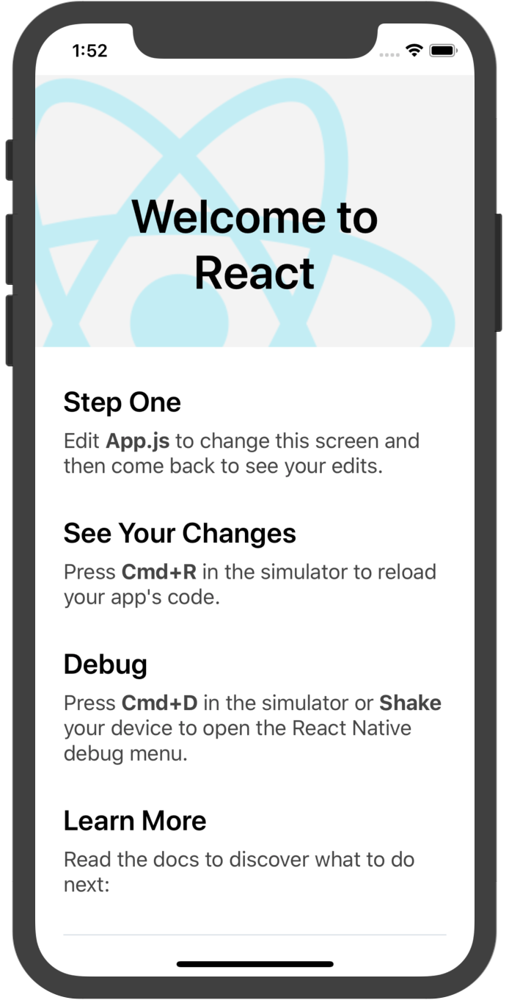
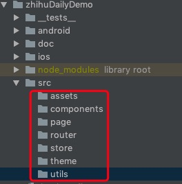

## zhihuDailyDemo


## 开发环境
1. macOS Mojave V10.14.6
2. node v12.8.1
3. yarn v1.17.3
4. xcode v10.3
5. genymotion v3.0.2


## 开发前注意事项
1. 组件在需要时才安装，不要一次安装过多组件，这样配置起来很繁琐，容易出错。
2. 安装完组件后把`bundler`窗口关闭，然后重新`react-native run-*`启动项目，重新编译打包。

## 一.项目初始化

1. 安装mac开发环境，
开发环境完全参照官网：[mac环境配置](https://reactnative.cn/docs/getting-started/)

2. 注意版本
   1. 使用`node -v` 查看node版本 nodev12.8.1
   2. 使用`react-native -v` 查看`react-native-cli`版本`: 2.0.1`
3. 使用`react-native init zhihuDailyDemo`初始化项目，这个过程可能会比较长，如果已经初始过的小伙伴就不会等很长时间，在目前版本中，会使用`react-native@0.60.5`这个版本中有`react-native-community`会`autolink`处理ios,android的组件。初始项目时会自动请求ios的cocoapods，如果看到这样的信息，`info Installing required CocoaPods dependencies
`就耐心等待，过一会就会成功
   
   
4. 可以通过命令行提示` Run instructions for iOS:` `react-native run-ios` 验证是否成功，第一次启动比较慢，耐心等待。
mac系统有xcode(正常情况下，xcode与系统一样都会保持最新)，会自动启动一个simulator，一个Bundler窗口。



5. 如果是android，需要首先自己启动android simulator，本机使用的是[Genymotion](http://www.genymotion.net/)，
6. 通过命令`react-native run-android`，第一次运行会比较慢，会自动autolink相关组件，编译等。
 
如果同时启动两个模拟器，bundler会有以下变化。

多出一个`android dev`通过以上步骤让rn创建的项目可以在ios,android上正常运行了，这是一个好的开始。

接下来就看看这个demo的实现思路，不管功能简单还是复杂，原理差不多，当然具体袦过程会有些不一样，rn项目里，让人最烦劳的就是link各类组件了，每个组件的配置又不一样。平台不同配置又可能不一样，从`react-native@0.60.5`开始有了`react-native-community`自动处理，会给大家带来很多方便，但也不是所有的组件都实现这个功能，也需要手动配置。具体还需要查看各组件文档。

---
## 开发思路
1. 页面结构（原型图）
2. 页面跳转（分析）
3. 整理需要用到的组件（是一名经验丰富的rn开发者，看了页面结构与功能后就知道会用到哪些组件）
4. 定义路由规则
5. 按功能一一实现

---
## 组件列表 

1. `mobx`状态管理
2. `react-navigation`路由
3. `react-native-elements`ui组件


## 本demo结构
是一个比较典型的结构，
1. 首页是一个list列表
2. 列表页点击进入详细页面
3. 顶部button

我的做法是根据原型，把路由定好，页面基本结构建立起来，再来实现功能，
组件引入也是需要多次引入的，不会一次性引入过多组件（老手除外）
所以第一次引入的组件就是简单，不同版本之间也有很大变化，`react-navigation`v3的版本没有把stack分离出来，但v4已经分离的，创建的方式也发生变化。
1. `react-navigation` [参考](https://reactnavigation.org/docs/en/getting-started.html)
    1. 注意依赖组件：`react-native-reanimated react-native-gesture-handler react-native-screens`
2. `react-navigation-drawer` 
3. `react-navigation-stack`

所以要正确使用路由实际需要安装6个组件。
1. 执行 `yarn add react-navigation react-native-reanimated react-native-gesture-handler react-native-screens react-navigation-drawer react-navigation-stack`
2. 执行 `cd ios && pod install`(记住`react-native@0.60.x`以后的版本autolink，所以不要一来就执行link操作)。
3. 看到以下`Detected React Native module pods for RNGestureHandler, RNReanimated, and RNScreens
        Analyzing dependencies
`三个组件通过pods安装了，不需要link，更不需要手动在`Podsfile`修改追加
4. 建立需要的目录结构，在根目录创建以下目录。看起来是这样的。

    
```text
assets 静态资源文件
components 组件
page 路由对应的具体页面
router 路由
store 数据状态
theme 主题
utils 公共工具
```

## 定义路由
1. 注意事项
    1. 定义路由要特别注意，路由外层不要使用View，SafeAreaView之类的组件包裹，否则看不到页面。
完整代码参考[Tag_1](https://github.com/gleams/reactNativeDemo/tree/tag_1/zhihuDailyDemo)  

## 准备会用到的工具
1. `axios` 的 HTTP 请求库
2. `moment`时间工具
3. `react-native-root-toast` 消息提示组件

根据需要封装项目需要的http工具

 


